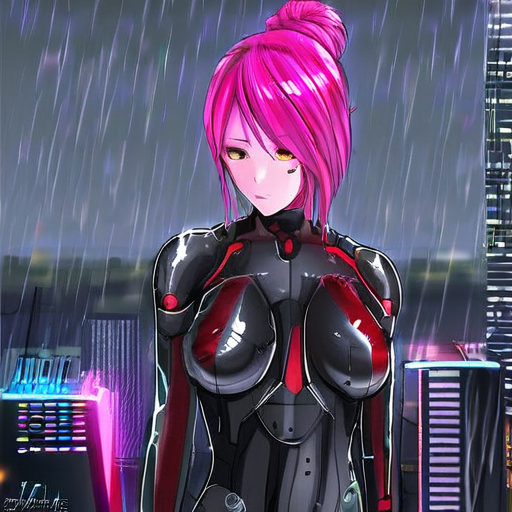
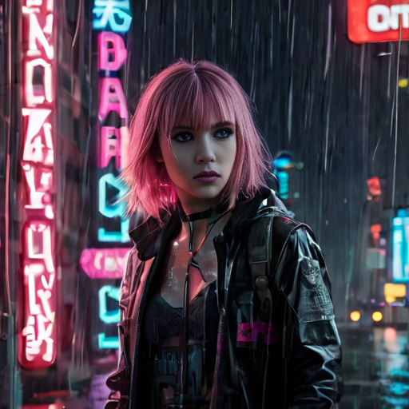
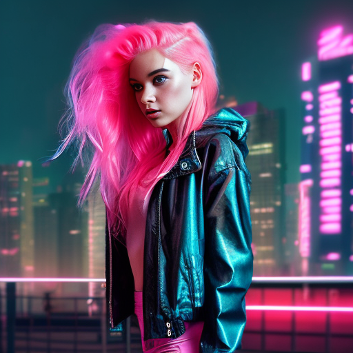
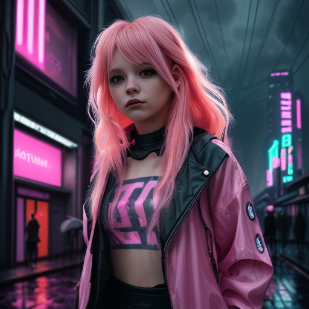

# Stable diffusion Web UI

## Refs

* https://github.com/AUTOMATIC1111/stable-diffusion-webui?tab=readme-ov-file#installation-and-running
* https://easywithai.com/guide/how-to-install-sdxl-locally/

## Dependencies

My main box has an AMD GPU, hence the rocm stuff.

    sudo apt install wget git python3 python3-venv libgl1 libglib2.0-0 libtcmalloc-minimal4 rocminfo

## Permissions

This is so the rocm utilities work. Add/sub any other users as needed.

    sudo usermod -a -G render matt

## Code

1. Clone as normal with:

       git clone https://github.com/AUTOMATIC1111/stable-diffusion-webui.git

## Custom setup

Edit `webui-user.sh` and change `COMMANDLINE_ARGS` to:

    export COMMANDLINE_ARGS="--skip-torch-cuda-test"

The first skips the CUDA test because I don't have a team green card.

## Setup

Run this once. It won't work, but it will get the dependencies and set
everything else up. It won't have any checkpoints, and will complain because of
that. See next step.

    cd stable-diffusion-webui
    ./webui.sh

## Download checkpoints, LoRAs, VAEs, etc.

Look around https://civitai.com

* Put checkpoints in `stable-diffusion-webui/models/Stable-diffusion`.
* LoRAs go in `stable-diffusion-webui/models/Lora`.
* VAEs go in `stable-diffusion-webui/models/VAE`.

## Overall notes

1. As of time of writing, it seems that the best models still have below 50%
   user acceptance of their output. More workaday models have around a 20%
   acceptance rate. The shotgun approach of generating several variations and
   picking the best ones seems appropriate here.

1. Outputs are cached/stored in `stable-diffusion-webui/outputs/`. Periodic
   cleanup will be necessary lest it bloat over time.

1. VAE's seem to mess up my rendering pipeline. Not sure what that's about. Not
   using any for now (set to "None" in config and not explicitly set in any
   model checkpoint config).

1. Certain models (for example, base Flux), seem to also not like LoRA's applied
   to them, having a similar failure as described above.

### Short list of models

#### Models that work reliably

##### For people

Prompt for these was "a girl with pink hair wearing a long trenchcoat, a rainy
neon-lit futuristic city in the background". No negative prompt. Everything else
left at defaults (even if this is not optimal use of the model).

* [Pony Diffusion V6 XL](https://civitai.com/models/257749)
  * Recommends a VAE, but when I use it, the final step ends up getting all
      messed up - funny colors, etc.
  * Cartoonish style, fun.

    
* [Pony Realism](https://civitai.com/models/372465)
  * Realistic version of Pony.

    

* [RPG v5](https://civitai.com/models/1116)
  * Stylized semi-realistic.

    

* [GhostXL](https://civitai.com/models/312431/ghostxl)

  * Ghost in the Shell inspired.
  * Would likely benefit from some mechanically-related prompting (because, robots)

    

* [AbsoluteReality](https://civitai.com/models/81458)

  * Less artsy, more realistic.
  * Results seem similar to Pony Realism.

    

##### For monsters

Prompt for these was "a photorealistic humanoid crocodile standing upright in a swamp with jaws open".

* [NVJOB Monster Art Generator](https://civitai.com/models/72384/nvjob-monster-art-generator)

  

###### For retro style RPG art

This may seem oddly specific, but I have fond memories of Twilight 2000 and Battletech,
which used this art style - apparently, so do other people. Prompts were based on what
they are supposed to generate - mecha and soldiers and such.

* [RPG Rifting in the
  90s](https://civitai.com/models/5324/rpg-rifting-in-the-90s)

  * Art style reminiscent of RIFTS.
  * Also good for WEG D6 Star Wars space ships.
  * Trigger is `PBOldRifRPGStyle`

  

* [RPG 2000's Ink and pencil style character
  generator](https://civitai.com/models/5988/rpg-2000s-ink-and-pencil-style-character-generator)

  * Art style reminiscent of Twilight 2000.
  * Also good for WEG D6 Star Wars characters.
  * Trigger is `TheRPGCharGenEsAFArt`, with a recommended weight between 0.5 and 1.12.

  

##### LoRAs

LoRAs (Low Rank Adaptations) can be thought of as "mods" for fine tuning a base
model without generating a new model.

For more information, see [this blog entry](https://huggingface.co/blog/lora).

These are trained off a specific base model and seem to only work when paired
with that exact model. I did some "with" and "without" tests using radically different
models and the LoRAs had no effect on the output.

Example images will be given as a "with" and "without" format, using the same
prompt and seed, but adding appropriate prompt triggers and LoRA invocation tags.

* [Star Wars style LoRA](https://civitai.com/models/105329/star-wars-style-lora)
  * Base: [AbsoluteReality
    1.6](https://civitai.com/models/81458?modelVersionId=108576)
  * I compared the difference between this on AR 1.6 and 1.81 and they worked
    exactly the same way, so I'm using the latest.
  * Triggers with the keyphrase `star wars`.

  * Without: 
  
  
  * With:
  
  
  * Honestly, I kind of like the "without" better - but both are fine.

#### Models that work sometimes

* [Flux.1
  [schnell]](https://huggingface.co/black-forest-labs/FLUX.1-schnell/tree/main)
  * License is Apache 2.0, so I can build off it.
  * Periodically generates noise, usually after using another model. Restarting
    the webapp seems to fix it - as long as it is the first model loaded.

    ![Flux.1
  [schnell] example](./images/flux_1_schnell.png
 "Flux.1
  [schnell] example")

* [Flux Unchained by SCG
  [SchnFu]](https://civitai.com/models/645943?modelVersionId=751510)

  * Derived from Flux.1 (above).
  * Periodically generates noise, usually after using another model. Restarting
    the webapp seems to fix it - as long as it is the first model loaded.

    ![Flux Unchained by SCG
  [SchnFu] example](./images/fluxUnchainedBySCG_schnfuV13Unet4step.png
 "Flux Unchained by SCG
  [SchnFu] example")

#### Models that don't work

* [Stable Diffusion XL
  Base](https://huggingface.co/stabilityai/stable-diffusion-xl-base-1.0/tree/main)
    * Python throws an exception when it tries to load the model.

# Ollama Web UI

TODO

# Integrating Stable Diffusion With Ollama

TODO
