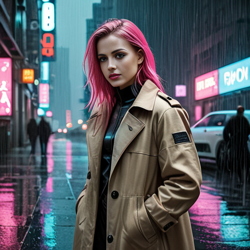
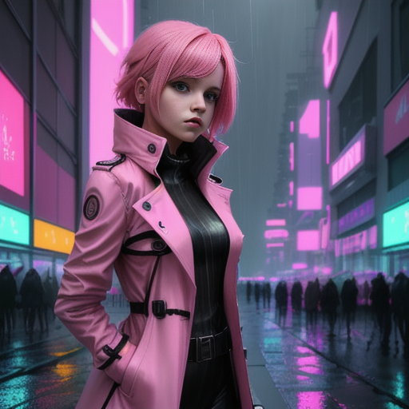
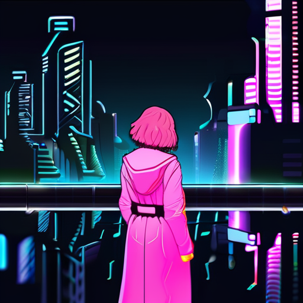
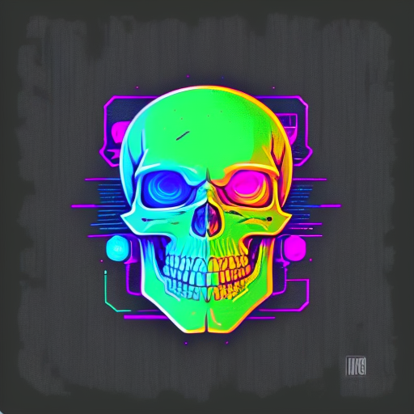

# Various AI tools and their associated web UIs

## Notes

* These instructions are for Ubuntu 24.04
* There are a pile of scripts to run them in <https://github.com/mattcaron/ai_scripts>.

## General dependencies

This is an aggregate set of dependencies for everything in this file. Many of them have the same dependencies, so it reduces duplication.

My main box has an AMD GPU, hence the rocm stuff.

    sudo add-apt-repository ppa:deadsnakes/ppa
    sudo apt install wget git python3.11-full python3.11-dev libgl1 libglib2.0-0 libtcmalloc-minimal4 build-essential libssl-dev libffi-dev cmake golang libclblast-dev

### Laptop specific dependencies (nVidia)

### Desktop specific dependencies (AMD)

    sudo apt install rocminfo

## Permissions

This is so the rocm utilities work. Add/sub any other users as needed.

    sudo usermod -a -G render matt

## Stable Diffusion Web UI (Image Generation)

### Refs

* <https://github.com/AUTOMATIC1111/stable-diffusion-webui?tab=readme-ov-file#installation-and-running>
* <https://easywithai.com/guide/how-to-install-sdxl-locally/>

### Code

1. Clone as normal with:

       git clone https://github.com/AUTOMATIC1111/stable-diffusion-webui.git
       cd stable-diffusion-webui
       git checkout v1.10.1

### Custom setup

Edit `webui-user.sh` set  `python_cmd` to:

    python_cmd="python3.11"

Because the system default python on Ubuntu 24.04 is too new.

### Setup

Run this once. It won't work, but it will get the dependencies and set
everything else up. It won't have any checkpoints, and will complain because of
that. See next step.

    cd stable-diffusion-webui
    ./webui.sh

### Download checkpoints, LoRAs, VAEs, etc

Look around <https://civitai.com>

* Put checkpoints in `stable-diffusion-webui/models/Stable-diffusion`.
* LoRAs go in `stable-diffusion-webui/models/Lora`.
* VAEs go in `stable-diffusion-webui/models/VAE`.

### Overall notes

1. As of time of writing, it seems that the best models still have below 50%
   user acceptance of their output. More workaday models have around a 20%
   acceptance rate. The shotgun approach of generating several variations and
   picking the best ones seems appropriate here.

1. Outputs are cached/stored in `stable-diffusion-webui/outputs/`. Periodic
   cleanup will be necessary lest it bloat over time.

1. VAE's seem to mess up my rendering pipeline. Not sure what that's about. Not
   using any for now (set to "None" in config and not explicitly set in any
   model checkpoint config).

1. Certain models (for example, base Flux), seem to also not like LoRA's applied
   to them, having a similar failure as described above.

#### Short list of models

**Note:** See [Stable Diffusion Notes](./stable_diffusion_notes.md) for model-specific config notes.

##### Models that work reliably

###### For people

Prompt for these was `a girl with pink hair wearing a long trenchcoat, a rainy
neon-lit futuristic city in the background`. No negative prompt. Everything else
left at defaults (even if this is not optimal use of the model).

* [AbsoluteReality](https://civitai.com/models/81458)

  

* [Crow & Pony | qp](https://civitai.com/models/845836/crow-and-pony-or-qp)

  

* [CyberRealistic Pony](https://civitai.com/models/443821)

  

* [DreamShaper XL](https://civitai.com/models/112902)

  

* [GhostXL](https://civitai.com/models/312431/ghostxl)

  * Ghost in the Shell inspired.
  * Would likely benefit from some mechanically-related prompting (because, robots)

  

* [Juggernaut XL](https://civitai.com/models/133005/juggernaut-xl)

  

* [Lyriel](https://civitai.com/models/22922/lyriel)
  
  

* [Mega Chonk XL | qp](https://civitai.com/models/885241)

  

* [Noteworthy | qp - ILL](https://civitai.com/models/1263181/noteworthy-or-qp)

  

* [Pony Diffusion V6 XL](https://civitai.com/models/257749)
  * Recommends a VAE, but when I use it, the final step ends up getting all
      messed up - funny colors, etc.

  

* [Pony Realism](https://civitai.com/models/372465)

  

* [Real Dream](https://civitai.com/models/153568/real-dream)

  

* [Realistic Vision (Hyper)](https://civitai.com/models/4201?modelVersionId=501240)

  

* [Rev Animated](https://civitai.com/models/7371/rev-animated)

 

* [RPG v5](https://civitai.com/models/1116)

  

* [SD XL](https://civitai.com/models/101055/sd-xl)

  This is one of the base model upon which other models are based. However, it is still useful to have around for comparison, or to use a LoRA which was based on it and might interact strangely with some other checkpoints.

  

###### For monsters

Prompt for these was "a photorealistic humanoid crocodile standing upright in a swamp with jaws open".

* [NVJOB Monster Art Generator](https://civitai.com/models/72384/nvjob-monster-art-generator)

  

###### For retro style RPG art

This may seem oddly specific, but I have fond memories of Twilight 2000 and Battletech,
which used this art style - apparently, so do other people. Prompts were based on what
they are supposed to generate - mecha and soldiers and such.

* [RPG Rifting in the 90s](https://civitai.com/models/5324/rpg-rifting-in-the-90s)

  * Art style reminiscent of RIFTS.
  * Also good for WEG D6 Star Wars space ships.
  * Trigger is `PBOldRifRPGStyle`

  

* [RPG 2000's Ink and pencil style character
  generator](https://civitai.com/models/5988/rpg-2000s-ink-and-pencil-style-character-generator)

  * Art style reminiscent of Twilight 2000.
  * Also good for WEG D6 Star Wars characters.
  * Trigger is `TheRPGCharGenEsAFArt`, with a recommended weight between 0.5 and 1.12 (e.g. `(TheRPGCharGenEsAFArt:0.7)`)

  

###### For coloring book pages

Oddly specific, I know.

* [Coloring Page Diffusion](https://civitai.com/models/22626/coloring-page-diffusion)

  

###### For T-Shirts and similar logos

Also oddly specific.. I know. But it's neat.

* [Magifactory T-Shirt Diffusion](https://civitai.com/models/4694/lessmagifactorygreater-t-shirt-diffusion)

  

###### LoRAs

LoRAs (Low Rank Adaptations) can be thought of as "mods" for fine tuning a base
model without generating a new model.

For more information, see [this blog entry](https://huggingface.co/blog/lora).

These are trained off a specific base model and seem to only work when paired
with that exact model. I did some "with" and "without" tests using radically different
models and the LoRAs had no effect on the output.

Example images will be given as a "with" and "without" format, using the same
prompt and seed, but adding appropriate prompt triggers and LoRA invocation tags.

* [Star Wars style LoRA](https://civitai.com/models/105329/star-wars-style-lora)
  * Base: [AbsoluteReality
    1.6](https://civitai.com/models/81458?modelVersionId=108576)
  * I compared the difference between this on AR 1.6 and 1.81 and they worked
    exactly the same way, so I'm using the latest.
  * Triggers with the keyphrase `star wars`.

  * Without:

    
  
  * With:

    
  
  * Honestly, I kind of like the "without" better - but both are fine.

**Loras for Logos**

There are several of these both for creating the channel logo and for other things - cyberpunk games, distopias, etc.

Our test phrase is `A logo for a bar with a mug full of beer, a cowboy hat, and the text "Last Chance Saloon"`.

Settings were tweaked to invoke the LoRA and to get good results based on usage notes (see the respective entries in [stable_diffusion_notes.md](./stable_diffusion_notes.md)), though geometry was left at 512 x 512 for quick tests.

Also note that most of them don't do text very well.

* [Cartoon Logo SDXL](https://civitai.com/models/234305/cartoon-logo-sdxl)

  

* [Harrlogos XL](https://civitai.com/models/176555/harrlogos-xl-finally-custom-text-generation-in-sd)

  

* [Logo Redmond](https://civitai.com/models/124609/logoredmond-logo-lora-for-sd-xl-10)

  

* [Logo Maker 9000](https://civitai.com/models/436281/logo-maker-9000-sdxl-concept)

  

##### Models that work sometimes

* [Flux.1
  [schnell]](https://huggingface.co/black-forest-labs/FLUX.1-schnell/tree/main)
  * License is Apache 2.0, so I can build off it.
  * Periodically generates noise, usually after using another model. Restarting
    the webapp seems to fix it - as long as it is the first model loaded.

    ![Flux.1
  [schnell] example](./images/flux_1_schnell.png
 "Flux.1
  [schnell] example")

* [Flux Unchained by SCG
  [SchnFu]](https://civitai.com/models/645943?modelVersionId=751510)

  * Derived from Flux.1 (above).
  * Periodically generates noise, usually after using another model. Restarting
    the webapp seems to fix it - as long as it is the first model loaded.

    ![Flux Unchained by SCG
  [SchnFu] example](./images/fluxUnchainedBySCG_schnfuV13Unet4step.png
 "Flux Unchained by SCG
  [SchnFu] example")

##### Models that don't work

* [Stable Diffusion XL
  Base](https://huggingface.co/stabilityai/stable-diffusion-xl-base-1.0/tree/main)
  * Python throws an exception when it tries to load the model.

#### Extensions

* [ReActor](https://github.com/Gourieff/sd-webui-reactor)
  * For face swaps.
  * Good for pranking your friends or just for using a face consistently
    throughout a photo set.

* [text2video](https://github.com/kabachuha/sd-webui-text2video)
  * For generating short video
  * Note that [you need to manually download and install some extra models](https://github.com/kabachuha/sd-webui-text2video?tab=readme-ov-file#where-to-get-the-weights)

* [ControlNet](https://github.com/Mikubill/sd-webui-controlnet.git)
  * Required by Deforum

* [Deforum](https://github.com/deforum-art/sd-webui-deforum)
  * For generating transformation videos (morping, etc.)
  * [Tutorial](https://stable-diffusion-art.com/deforum/)

## Ollama (for text interactions)

### References

* <https://github.com/ollama/ollama/blob/main/docs/linux.md#manual-install>

### Installation

  1. Base install:

         wget https://ollama.com/download/ollama-linux-amd64.tgz
         tar -xf ollama-linux-amd64.tgz

  1. Optional extra package for AMD GPUs

         wget https://ollama.com/download/ollama-linux-amd64-rocm.tgz
         tar -xf ollama-linux-amd64-rocm.tgz

### Pull models with

    ollama pull <model>
    
  You can find more models at <https://ollama.com/models>

### Run it

  (Just to test - we'll use one of the scripts to run it for real).

    ollama serve

  It should start up without any errors.

### Interfaces

#### Open Web UI (for Ollama)

##### References

* <https://docs.openwebui.com/getting-started/#build-and-install-%EF%B8%8F>

##### Installation

1. Prerequisites - versions 0.5.15 and later require node22.

    * Cribbed from <https://deb.nodesource.com/setup_22.x> but I don't run random scripts from the internet.

    1. Add key

           wget -O- https://deb.nodesource.com/gpgkey/nodesource-repo.gpg.key | sudo gpg --no-default-keyring --keyring=/usr/share/keyrings/nodesource.gpg --import

    1. Create `/etc/apt/sources.list.d/nodesource.list` as follows:

           deb [arch=amd64 signed-by=/usr/share/keyrings/nodesource.gpg] https://deb.nodesource.com/node_22.x nodistro main
           
    1. Create `/etc/apt/preferences.d/nsolid` as follows:

           Package: nsolid
           Pin: origin deb.nodesource.com
           Pin-Priority: 600

    1. Create `/etc/apt/preferences.d/nodejs` as follows:

         Package: nodejs
         Pin: origin deb.nodesource.com
         Pin-Priority: 600

    1. Fix perms:

         sudo chmod a+r /etc/apt/sources.list.d/nodesource.list /etc/apt/preferences.d/nsolid /etc/apt/preferences.d/nodejs

    1. Install it:

         sudo apt update
         sudo apt install -y nodejs

1. Clone it and go there

       git clone https://github.com/open-webui/open-webui.git
       cd open-webui
       git checkout v0.5.15

1. Create a venv for into which we install things (to keep it all compartmentalized)

       npm install
       npm run build
       python3.11 -m venv venv
       source venv/bin/activate
       pip install --upgrade pip
       pip install -r backend/requirements.txt -U

1. Note that updates are an abbreviated version of the above:

       cd open-webui
       git fetch
       git checkout <new version>

       npm install
       npm run build
       source venv/bin/activate
       pip install -r backend/requirements.txt -U

1. Run it with:

     source venv/bin/activate
     ./backend/start.sh

(But, again, we'll have a script to make this all easy later in the document.)

#### Notes

##### RAG

1. Don't use the default embedding model (SentenceTransformers), as it is very basic. Use a proper embedding model. My current favorite is `snowflake-arctic-embed`.

1. If you change the embedding model, you need to reimport all documents. In some (many? most?) cases, this actually means removing the knowledge store, creating a new one, then re-importing things due to the database setup being set for the vector size that the embedding engine (or model?) produces.

1. If you get a file import error and a complaint that it "cannot handle this data type" and the uploaded file type is a PDF, try turning off PDF OCR. This means that it choked on some image in the document which is in some format that it doesn't understand and therefore can't process.

#### Roo Code plugin for VSCode / Codium

    codium --install-extension rooveterinaryinc.roo-cline

#### Continue plugin for VSCode / Codium

    codium --install-extension continue.continue

And then configure it:

   1. Open it by hitting Ctrl + L. That will open the sidebar and bring up the quickstart.. which is annoying and doesn't use the things we want.
   1. Click the gear to open the `config.json` at the correct spot, and set it up like this:

          "models": [
            {
              "model": "llama3.2:1b",
              "provider": "ollama",
              "title": "Llama 3.2: 1b",
              "apiBase": "http://localhost:11434/"
            },
            {
              "model": "dolphin-llama3:latest",
              "provider": "ollama",
              "title": "Dolphin Llama 3",
              "apiBase": "http://localhost:11434/"
            }
          ],
          "tabAutocompleteModel": {
            "title": "Dolphin Coder",
            "provider": "ollama",
            "model": "dolphincoder:latest",
            "apiBase": "http://localhost:11434/"
          },
          "embeddingsProvider": {
            "model": "mxbai-embed-large:latest",
            "provider": "ollama"
          },

Now you can do the AI things.

#### Page Assist for Firefox

1. Install the Page Assist extension via the normal "extensions" method.
1. Open the settings and:
    1. Under `RAG Settings`, set the model to `nomic-embed-text:latest`
1. Set the model however you want it based on what is appropriate for the hardware on which it is running.

#### ThunderAI for Thunderbird

1. Install the Thunder AI extension via the normal "Add Ons" method.
1. Open the settings and:
   1. Change "Connection Type" to `Ollama API`
   1. Set "Host Address" to `http://127.0.0.1:11434`
   1. Click `Update Ollama Models List`
   1. Select an appropriate model for the hardware on which it is running.

## A big note on AI on AMD GPUs

I've had issues where, under large workloads (big Stable Diffusion images, long running WhisperX translations), my machine would panic reboot.

[It turns out, I am not alone](https://github.com/ROCm/ROCm/issues/2330).

As an aside, there is [more information about this here](https://unix.stackexchange.com/questions/620072/reduce-amd-gpu-wattage).

As near as I can tell, AIB partners love to "factory overclock" these cards and they work fine for their target workloads - that is, *gaming*, but AI seems to push things a little harder, which can cause issues.

I'm not a big fan of overclocking things, but I love overclockers for pushing board manufacturers to use higher quality components. I tend to buy overclocking-friendly boards and then just leave them at stock frequencies - in which case they will basically last forever, because they are so overbuilt.

For reference, my graphics card us an [ASRock 6900XT OC Formula](https://www.asrock.com/Graphics-Card/AMD/Radeon%20RX%206900%20XT%20OC%20Formula%2016GB/). Also, here are the [actual factory specs](https://www.amd.com/en/products/graphics/desktops/radeon/6000-series/amd-radeon-rx-6900-xt.html).

However, in my testing, despite the P BIOS boost supposedly maxing out at 2475MHz, I checked the settings in `pp_od_clk_voltage` (see below) and it was set to *2594Mhz*! So, the driver was overclocking it by a further 119Mhz, which would explain some of the problems that I was seeing.

Anyway, on to fixing things.

For starters, there are a pile of settings in `/sys/class/drm/cardN/device`. Note that the card number will vary depending on your build, but it's almost always 0 or 1. There are a pile of files in there, many of which are documented [here](https://dri.freedesktop.org/docs/drm/gpu/amdgpu.html#gpu-sysfs-power-state-interfaces).

There is also `/sys/kernel/debug/dri/N` (where N is the same number as in `cardN`, above), which has a pile of stuff which you can read, the most interesting of which is likely the first few lines of `amdgpu_pm_info`, which shows clocks, voltages, etc.

A rough amount of testing can be achieved by setting one of the following values in `power_dpm_force_performance_level`:

    auto
    low
    high
    manual
    profile_standard
    profile_min_sclk
    profile_min_mclk
    profile_peak

You can set it via:

    echo "low" | sudo tee power_dpm_force_performance_level

The default is auto, and that has my GPU hovering around 28W at idle.

If I set it to low, my GPU hovers around 18W at idle.

Running a WhisperX test, I find that the power consumption stays around 30W, but the performance is pretty abysmal - a transcription that takes about 50 seconds on "auto" takes around 2m 40s, which is pretty bad (as in "might as well run it on the CPU" bad.). "high" forces it high and you can see the temperatures and frequency climb, which is almost certainly going to lead the problems I've seen before.

Anyway, the main reason to do this is that it's a quick test before you do something invasive and potentially dangerous. To wit - if you have a test you can run which panic reboots the machine, and you suspect it's the video card, so you set the performance level to low, run it, and it *still* reboots the machine, then nothing in this section is going to help you.

However, if it does stop the crashes, and you want to proceed to adjust clock rates, then you need to "unlock" the overclocking features in the driver... and then underclock things.

1. Set the feature mask to unlock overclocking

   Edit `/etc/default/grub`, find the `GRUB_CMDLINE_LINUX_DEFAULT` line and add

       amdgpu.ppfeaturemask=0xffffffff

   to the end.

   Save it, then do:

       sudo update-grub

   And then reboot.

1. Check current settings.

    Now, `/sys/class/drm/card1/device/pp_od_clk_voltage` should exist, and you can `cat` it to see settings.

       OD_SCLK:
       0: 500Mhz
       1: 2594Mhz
       OD_MCLK:
       0: 97Mhz
       1: 1000MHz
       OD_VDDGFX_OFFSET:
       0mV
       OD_RANGE:
       SCLK:     500Mhz       4000Mhz
       MCLK:     674Mhz       1312Mhz

1. Modify settings

    Based on the values read above, I want to drop the P1 state OD_SCLK frequency down to AMD's stated maximum of 2475MHz, which is the ASRock's maximum stated boost frequency for this card.

       echo "s 1 2475" | sudo tee pp_od_clk_voltage

   Then, you need to run to actually activate the changes:

       echo "c" | sudo tee pp_od_clk_voltage

1. Test it

   Make sure it works. At this point, a reboot clears it.

1. Make them permanent

   1. Create the file `/usr/bin/set_gpu_clocks` with the following content:

          #!/bin/sh
          echo "s 1 2475" > /sys/class/drm/card1/device/pp_od_clk_voltage
          echo "c" > /sys/class/drm/card1/device/pp_od_clk_voltage

       Note the lack of `sudo` here, as that is unnecessary when run at system startup as it runs as root.

   1. Set the perms on it:

          sudo chmod 744 /usr/bin/set_gpu_clocks

   1. Create the file `/etc/systemd/system/set_gpu_clocks.service` with the following content:

          [Unit]
          Description=Set GPU clocks

          [Service]
          Type=oneshot
          ExecStart=/usr/bin/set_gpu_clocks

          [Install]
          WantedBy=multi-user.target

   1. Enable the above:

          sudo systemctl enable set_gpu_clocks.service

      Now the clock settings should persist across reboots.

## Audiocraft WebUi (for music generation)

    python3.11 -m venv venv
    source venv/bin/activate
    pip install -r requirements.txt
    pip install torch torchaudio --index-url https://download.pytorch.org/whl/cu128
    python3.11 webui.py

## WhisperX (for generating Subtitles / Closed Captions)

### Basic install

  The installation of nvidia-cudnn are supporting libraries for nVidia cards. If you have an AMD card, they are unnecessary, and you should compile CTranslate2-rocm as directed below. The torch / torchaudio install line is specifically for nVidia 50xx series GPUs which need the new library - other GPUs (older nVidia and all AMD) can skip that line because the default dependencies are fine.

    sudo apt install nvidia-cudnn
    mkdir ~/storage1/ai/whisperx
    cd ~/storage1/ai/whisperx
    python -m venv venv
    source venv/bin/activate
    pip install torch torchaudio --index-url https://download.pytorch.org/whl/cu128
    pip install whisperx
    deactivate

And then the `subtitle_video` script will work.

### Compile the CTranslate2-rocm library (Machines with AMD GPUs only)

This is a lot of work, but it is an order of magnitude faster. It replaces some of the libraries installed above as part of the installation.

Also, it throws warnings like crazy, but works.

#### CTranslate2-rocm howto guide

<https://github.com/arlo-phoenix/CTranslate2-rocm/blob/rocm/README_ROCM.md>

#### Install ROCm development files

**This is for AMD GPUs**. If you're using an Nvidia GPU, this is not useful. But, then again, if you are on team green, this is likely just working for you without any special tricks.

##### Dependencies

**WARNING** This installs about 40GB of libraries into the system install location (typically hanging off of `/`).

Note that we install version 6.2.0 here because that is what the arlo-phoenix CTranslate2 fork was compiled and tested against.

This installs:

1. ROCm libs from AMD repos.
2. A bunch of compilers and supporting libraries.

**NOTE** This is not exhaustive. I just documented what I needed to install in order to get things to build, but I already had a pile of things installed.

1. Add signing key to list of keyrings

       wget -O- https://repo.radeon.com/rocm/rocm.gpg.key | sudo gpg --no-default-keyring --keyring=/etc/apt/keyrings/rocm.gpg --import

2. Set up repository file.

       sudo sh -c 'echo "deb [arch=amd64 signed-by=/etc/apt/keyrings/rocm.gpg] https://repo.radeon.com/rocm/apt/6.2 noble main" >> /etc/apt/sources.list.d/rocm.list'

3. Give priority to the stuff from AMD:

       sudo sh -c 'echo "Package: *\nPin: release o=repo.radeon.com\nPin-Priority: 600" > /etc/apt/preferences.d/rocm-pin-600'

4. Actually install things

   Most recent ROCm and compilers. Note that just installing `rocm` fails because `rocdecode` needs `mesa-amdgpu-va-drivers`, which is not installable. So, we install some smaller metapackages. We also need to uninstall the `rocminfo` that we installed above because these want a different version.

       sudo apt update
       sudo apt remove rocminfo
       sudo apt install hipcc clang lld clang-tools-17 libstdc++-14-dev libomp-dev rocm-libs rocm-core rocm-dev rocminfo
       
#### Build native libs

    git clone https://github.com/arlo-phoenix/CTranslate2-rocm.git --recurse-submodules
    cd CTranslate2-rocm
    export PYTORCH_ROCM_ARCH=gfx1030 # Works for AMD 6900XT

    CLANG_CMAKE_CXX_COMPILER=clang++ CXX=clang++ HIPCXX="$(hipconfig -l)/clang" HIP_PATH="$(hipconfig -R)" cmake -S . -B build -DWITH_MKL=OFF -DWITH_HIP=ON -DCMAKE_HIP_ARCHITECTURES=$PYTORCH_ROCM_ARCH -DBUILD_TESTS=ON -DWITH_CUDNN=ON 

    # The explicit PATH set here is so it can find `clang-offload-bundler`
    # Set the -j number to something appropriate for your system. Mine can do 16 threads,
    # hence the 16.
    PATH=$PATH:/opt/rocm-6.2.0/lib/llvm/bin/ cmake --build build -- -j16

#### Python install

    # Bootstrap venv
    source ~/storage1/ai/whisperx/venv/bin/activate
    
    # Install our compiled CTranslate glue
    cd ~/storage1/ai/CTranslate2-rocm/python
    pip install -r install_requirements.txt
    python setup.py build_ext --library-dirs=../build/ --include-dirs=../include/
    python setup.py bdist_wheel
    pip install dist/*.whl

    # deps
    pip3 install torch torchvision torchaudio --index-url https://download.pytorch.org/whl/rocm6.2 --force-reinstall

    deactivate

### Runtime Notes

You need to both activate the VENV and set `LD_LIBRARY_PATH=/home/matt/storage1/ai/CTranslate2-rocm/build` (or wherever you put it) when running WhisperX, e.g.:

    source /home/matt/storage1/ai/whisperx/venv/bin/activate
    LD_LIBRARY_PATH=/home/matt/storage1/ai/CTranslate2-rocm/build whisperx

## One startup script to rule them all

The scripts are in <https://github.com/mattcaron/ai_scripts> and handles optionally integrating Stable Diffusion with Open-Webui/Ollama (conditional as to whether SD is running), because we do so via a configuration fed via environment variables set by the scripts.

Alas, MusicGPT is not yet integrated with Open WebUI, so we'll have to use it separately. There's a wrapper script for it to generate several samples based on the same prompt.

There's also a wrapper script for WhisperX which sets the common things we use so we don't have to keep adding them.

Now, all that said, as nice as the Stable Diffusion integration is, it's a more simplified interface, and the one provided by Automatic111 as so many more knobs to frob - so it's accessible via the traditional web UI even when it's integrated with Open WebUI.
