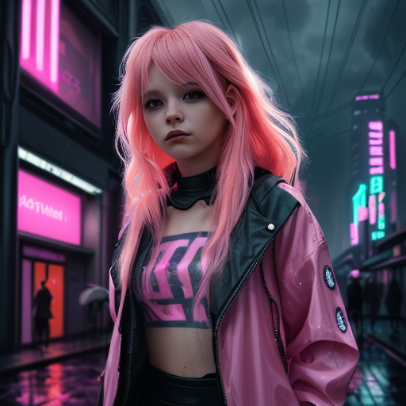
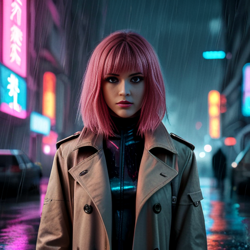
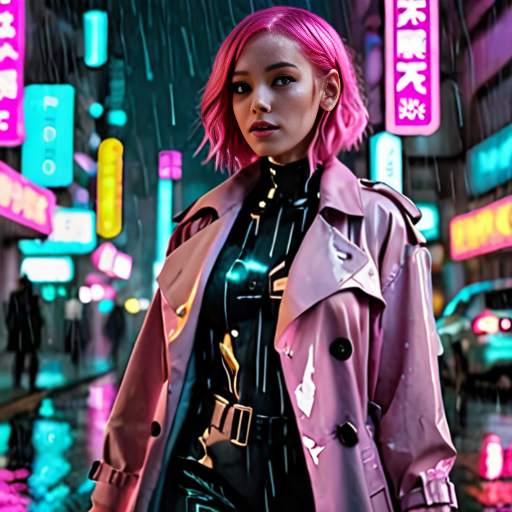
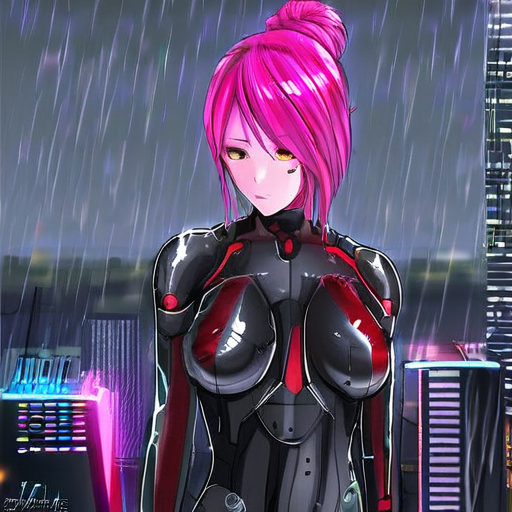
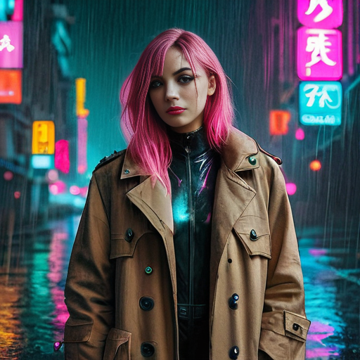
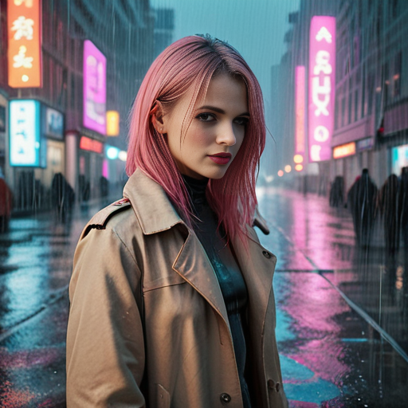
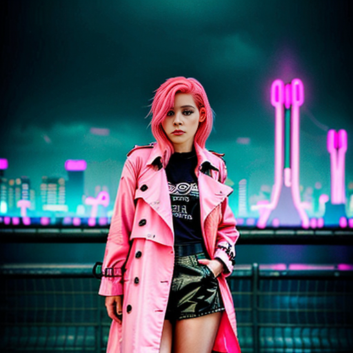
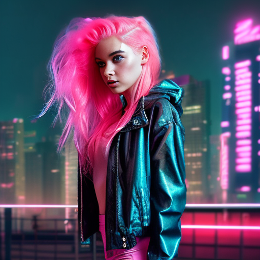

# Various AI web UIs

## Notes

* These instructions are for Ubuntu 24.04
* There are a pile of scripts to run them in <https://github.com/mattcaron/ai_scripts>.

## General dependencies

This is an aggregate set of dependencies for everything in this file. Many of them have the same dependencies, so it reduces duplication.

My main box has an AMD GPU, hence the rocm stuff.

    sudo add-apt-repository ppa:deadsnakes/ppa
    sudo apt install wget git python3.11 python3.11-venv python3.11-dev libgl1 libglib2.0-0 libtcmalloc-minimal4 build-essential libssl-dev libffi-dev cmake golang libclblast-dev

### Laptop specific dependencies (nVidia)

### Desktop specific dependencies (AMD)

    sudo apt install rocminfo

## Permissions

This is so the rocm utilities work. Add/sub any other users as needed.

    sudo usermod -a -G render matt

## Stable Diffusion Web UI (Image Generation)

### Refs

* https://github.com/AUTOMATIC1111/stable-diffusion-webui?tab=readme-ov-file#installation-and-running
* https://easywithai.com/guide/how-to-install-sdxl-locally/

### Code

1. Clone as normal with:

       git clone https://github.com/AUTOMATIC1111/stable-diffusion-webui.git
       cd stable-diffusion-webui
       git checkout v1.10.1

### Custom setup

Edit `webui-user.sh` set  `python_cmd` to:

    python_cmd="python3.11"

Because the system default python on Ubuntu 24.04 is too new.

### Setup

Run this once. It won't work, but it will get the dependencies and set
everything else up. It won't have any checkpoints, and will complain because of
that. See next step.

    cd stable-diffusion-webui
    ./webui.sh

### Download checkpoints, LoRAs, VAEs, etc.

Look around https://civitai.com

* Put checkpoints in `stable-diffusion-webui/models/Stable-diffusion`.
* LoRAs go in `stable-diffusion-webui/models/Lora`.
* VAEs go in `stable-diffusion-webui/models/VAE`.

### Overall notes

1. As of time of writing, it seems that the best models still have below 50%
   user acceptance of their output. More workaday models have around a 20%
   acceptance rate. The shotgun approach of generating several variations and
   picking the best ones seems appropriate here.

1. Outputs are cached/stored in `stable-diffusion-webui/outputs/`. Periodic
   cleanup will be necessary lest it bloat over time.

1. VAE's seem to mess up my rendering pipeline. Not sure what that's about. Not
   using any for now (set to "None" in config and not explicitly set in any
   model checkpoint config).

1. Certain models (for example, base Flux), seem to also not like LoRA's applied
   to them, having a similar failure as described above.

#### Short list of models

**Note:** See [Stable Diffusion Notes](./stable_diffusion_notes.md) for model-specific config notes.

##### Models that work reliably

###### For people

Prompt for these was "a girl with pink hair wearing a long trenchcoat, a rainy
neon-lit futuristic city in the background". No negative prompt. Everything else
left at defaults (even if this is not optimal use of the model).

* [AbsoluteReality](https://civitai.com/models/81458)

  

* [CyberRealistic Pony](https://civitai.com/models/443821)

  

* [DreamShaper XL](https://civitai.com/models/112902)

  

* [GhostXL](https://civitai.com/models/312431/ghostxl)

  * Ghost in the Shell inspired.
  * Would likely benefit from some mechanically-related prompting (because, robots)

  

* [Juggernaut XL](https://civitai.com/models/133005/juggernaut-xl)

  

* [Lyriel](https://civitai.com/models/22922/lyriel)
  
  

* [Pony Diffusion V6 XL](https://civitai.com/models/257749)
  * Recommends a VAE, but when I use it, the final step ends up getting all
      messed up - funny colors, etc.

  

* [Pony Realism](https://civitai.com/models/372465)

  

* [Real Dream](https://civitai.com/models/153568/real-dream)

  

* [Realistic Vision (Hyper)](https://civitai.com/models/4201?modelVersionId=501240)

  

* [RPG v5](https://civitai.com/models/1116)

  

###### For monsters

Prompt for these was "a photorealistic humanoid crocodile standing upright in a swamp with jaws open".

* [NVJOB Monster Art Generator](https://civitai.com/models/72384/nvjob-monster-art-generator)

  

###### For retro style RPG art

This may seem oddly specific, but I have fond memories of Twilight 2000 and Battletech,
which used this art style - apparently, so do other people. Prompts were based on what
they are supposed to generate - mecha and soldiers and such.

* [RPG Rifting in the 90s](https://civitai.com/models/5324/rpg-rifting-in-the-90s)

  * Art style reminiscent of RIFTS.
  * Also good for WEG D6 Star Wars space ships.
  * Trigger is `PBOldRifRPGStyle`

  

* [RPG 2000's Ink and pencil style character
  generator](https://civitai.com/models/5988/rpg-2000s-ink-and-pencil-style-character-generator)

  * Art style reminiscent of Twilight 2000.
  * Also good for WEG D6 Star Wars characters.
  * Trigger is `TheRPGCharGenEsAFArt`, with a recommended weight between 0.5 and 1.12 (e.g. `(TheRPGCharGenEsAFArt:0.7)`)

  

###### LoRAs

LoRAs (Low Rank Adaptations) can be thought of as "mods" for fine tuning a base
model without generating a new model.

For more information, see [this blog entry](https://huggingface.co/blog/lora).

These are trained off a specific base model and seem to only work when paired
with that exact model. I did some "with" and "without" tests using radically different
models and the LoRAs had no effect on the output.

Example images will be given as a "with" and "without" format, using the same
prompt and seed, but adding appropriate prompt triggers and LoRA invocation tags.

* [Star Wars style LoRA](https://civitai.com/models/105329/star-wars-style-lora)
  * Base: [AbsoluteReality
    1.6](https://civitai.com/models/81458?modelVersionId=108576)
  * I compared the difference between this on AR 1.6 and 1.81 and they worked
    exactly the same way, so I'm using the latest.
  * Triggers with the keyphrase `star wars`.

  * Without:

    
  
  * With:

    
  
  * Honestly, I kind of like the "without" better - but both are fine.

##### Models that work sometimes

* [Flux.1
  [schnell]](https://huggingface.co/black-forest-labs/FLUX.1-schnell/tree/main)
  * License is Apache 2.0, so I can build off it.
  * Periodically generates noise, usually after using another model. Restarting
    the webapp seems to fix it - as long as it is the first model loaded.

    ![Flux.1
  [schnell] example](./images/flux_1_schnell.png
 "Flux.1
  [schnell] example")

* [Flux Unchained by SCG
  [SchnFu]](https://civitai.com/models/645943?modelVersionId=751510)

  * Derived from Flux.1 (above).
  * Periodically generates noise, usually after using another model. Restarting
    the webapp seems to fix it - as long as it is the first model loaded.

    ![Flux Unchained by SCG
  [SchnFu] example](./images/fluxUnchainedBySCG_schnfuV13Unet4step.png
 "Flux Unchained by SCG
  [SchnFu] example")

##### Models that don't work

* [Stable Diffusion XL
  Base](https://huggingface.co/stabilityai/stable-diffusion-xl-base-1.0/tree/main)
  * Python throws an exception when it tries to load the model.

#### Extensions

* [ReActor](https://github.com/Gourieff/sd-webui-reactor)
  * For face swaps.
  * Good for pranking your friends or just for using a face consistently
    throughout a photo set.

* [text2video](https://github.com/kabachuha/sd-webui-text2video)
  * For generating short video
  * Note that [you need to manually download and install some extra models](https://github.com/kabachuha/sd-webui-text2video?tab=readme-ov-file#where-to-get-the-weights)

## Ollama (for text interactions)

### References

* https://github.com/ollama/ollama/blob/main/docs/linux.md#manual-install

### Installation

  1. Base install:

         wget https://ollama.com/download/ollama-linux-amd64.tgz
         tar -xf ollama-linux-amd64.tgz

  1. Optional extra package for AMD GPUs

         wget https://ollama.com/download/ollama-linux-amd64-rocm.tgz
         tar -xf ollama-linux-amd64-rocm.tgz

### Pull models with

    ollama pull <model>
    
  You can find more models at <https://ollama.com/models>

### Run it

  (Just to test - we'll use one of the scripts to run it for real).

    ollama serve

  It should start up without any errors.

### Interfaces

#### Ollama Web UI

##### References

* https://docs.openwebui.com/getting-started/#build-and-install-%EF%B8%8F

##### Installation

1. Clone it and go there

       git clone https://github.com/open-webui/open-webui.git
       cd open-webui
       git checkout v0.3.32

1. Create a venv for into which we install things (to keep it all compartmentalized)

       npm install
       npm run build
       python3.11 -m venv venv
       source venv/bin/activate
       pip install --upgrade pip
       pip install -r backend/requirements.txt -U

1. Note that updates are an abbreviated version of the above:

       cd open-webui
       git fetch
       git checkout <new version>

       npm install
       npm run build
       source venv/bin/activate
       pip install -r backend/requirements.txt -U

1. Run it with:

     source venv/bin/activate
     ./backend/start.sh

(But, again, we'll have a script to make this all easy later in the document.)

#### Continue plugin for VSCode / Codium

TODO - document

#### Page Assist for Firefox

TODO - document

#### ThunderAI for Thunderburd

TODO - document

## MusicGPT (For music generation)

### Install

**Note**: This assumes a functional Rust/cargo install (which I have).

    git clone https://github.com/gabotechs/MusicGPT.git
    cd MusicGPT
    git checkout v0.3.4
    cargo build

### Running

It has 2 modes, GUI and CLI. They take common args, which you can view with `--help`.

#### GUI

    musicgpt

Note that the GUI is a WebUI running locally, and the music playback is all distorted under Firefox. Chrome works fine, however.

#### CLI

    musicgpt "Your prompt goes here"

#### Storage hack

By default, MusicGPT stores things in `~/.local/share/musicgpt`. Let's not. So, move that dir to `~/storage1/ai` and then symlink back - `cd ~/.local/share && ln -s ~/storage1/ai/musicgpt .`

## One startup script to rule them all

The scripts are in <https://github.com/mattcaron/ai_scripts> and handles optionally integrating Stable Diffusion with Open-Webui/Ollama (conditional as to whether SD is running), because we do so via a configuration fed via environment variables set by the scripts.

Alas, MusicGPT is not yet integrated with Open WebUI, so we'll have to use it separately.

Now, all that said, as nice as the Stable Diffusion integration is, it's a more simplified interface, and the one provided by Automatic111 as so many more knobs to frob - so it's accessible via the traditional web UI even when it's integrated with Open WebUI.